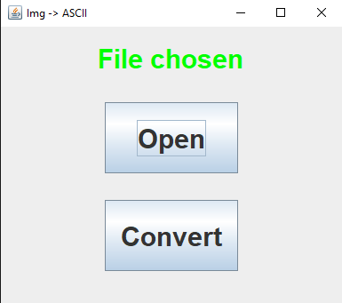
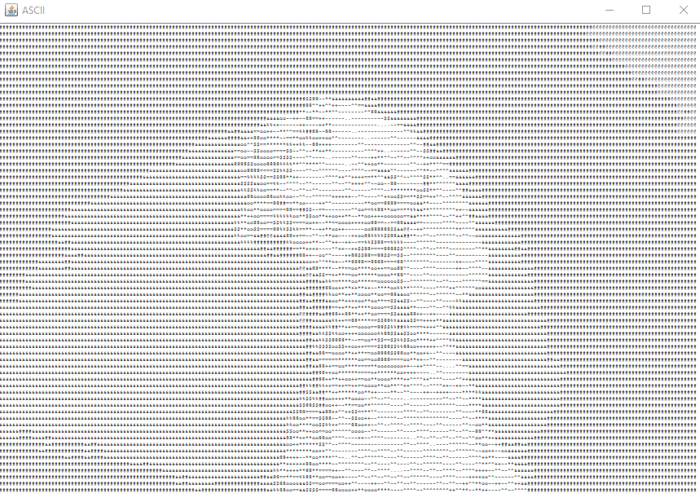
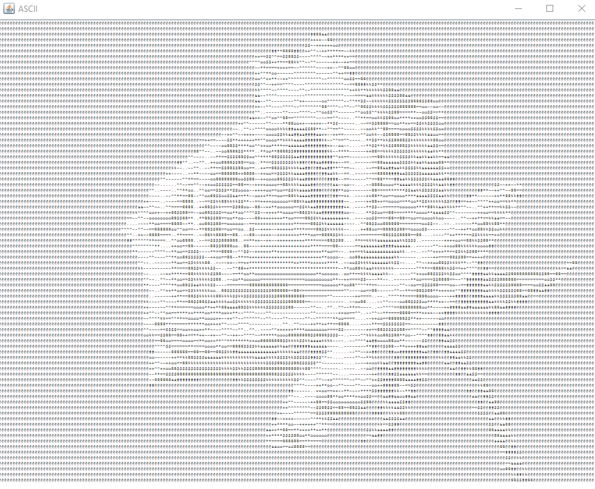

# Image-ASCII Converter

Application for converting images into set of ASCII characters that are menat to resemble it.

## Demo

[Executable](ImgToASCII.jar) - Requires Java!

## Screenshots

## Features

- Image to ASCII conversion
- Image extension validation
- Results displayed in two separate windows

## Technologies

- Java
- Swing

## Authors

- [@dkrucze](https://github.com/TheKiromen)
